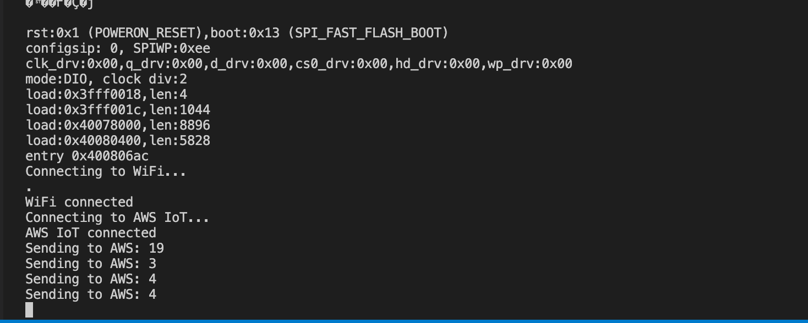
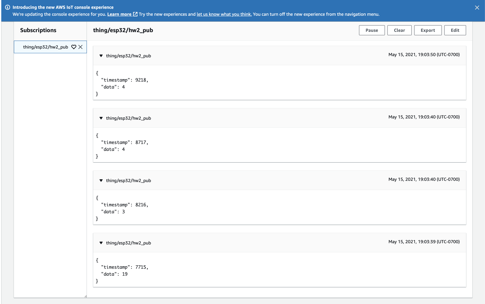

# CMPE 181 HW2

This project utilizes the built-in touch sensor of the ESP32 microcontroller. It uses FreeRTOS to manage the tasks and is connected to AWS IoT Core. It is set up so that if the user touches the touch sensor pin (labeled as D4 on the ESP32 board), the ESP32 publishes the analog value to a topic in AWS, ```thing/esp32/hw2_pub```.

In this homeowork, I successfully created a thing on AWS Console and wrote code to connect to wifi and AWS IoT Core. I also successfuly wrote code to publish data to a MQTT topic. One thing I tried to do but was not successful in was the ESP32 subscription. The ```onMessage``` API in the MQTT library does not seem to work as expected. Although the code is there in my ```main.cpp```, for some reason it does not receive the messaage from AWS MQTT Test page.

### Screenshots
Here are some relevant screenshots during my testing. Other screenshots are also available in the ```screenshots``` folder.

1. Terminal Screenshot

2. AWS MQTT Test Page Screenshot
